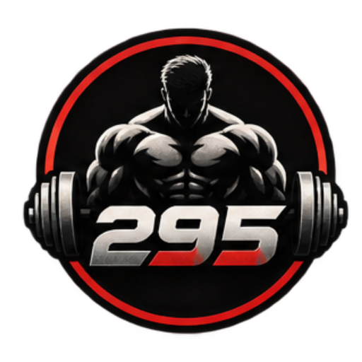

<div align="center">

  

  # 295 Fitness Gym
  
  **No Shortcuts. No Gimmicks. Just Hard Work & Science-Backed Training.**

  [](https://reactjs.org/)
  [](https://www.typescriptlang.org/)
  [](https://vitejs.dev/)
  [](https://tailwindcss.com/)
  [](LICENSE)

  <p align="center">
    Official web application for <b>295 Fitness Gym</b> — a premier 10,000+ sq ft strength and conditioning facility in Bilasipara, Dhubri, Assam.
  </p>

</div>

---

## 📖 Overview

**295 Fitness Gym** is built around biomechanically engineered equipment, progressive overload programming, and hands-on 1-on-1 coaching led by **Coach Ejaj Hussain**. This web application delivers a high-performance, dark-aesthetic digital experience that reflects the grit, discipline, and authentic atmosphere of the facility.

### ✨ Highlights & Features

- **🔥 Authentic Gym Visuals**: Integrated high-resolution photography showcasing the real training floor, free-weight dumbbell area, and the iconic *"DISCIPLINE BUILDS FREEDOM"* wall.
- **⚡ Cinematic Hero Section**: Hardware-accelerated ambient Ken Burns motion with calibrated contrast gradient overlays and responsive typography.
- **🎯 The 295 Philosophy**: Featuring Coach Ejaj Hussain with principles of science-backed programming, individualized protocols, and hands-on coaching.
- **🏋️ Facility Highlights**: Interactive showcase of the 10,000+ sq ft facility, biomechanical machinery, cardio, and mobility zones.
- **💳 Transparent Pricing**: Clear membership tiers starting at ₹799/month with instant WhatsApp booking integration.
- **📍 Real-Time Location & Hours**: Embedded Google Map for the Bangalipara, Bilasipara location with one-click navigation and direct contact channels.
- **🎨 Brand Design System**: Custom tailored `#D61F1F` crimson theme, deep obsidian background (`#0A0A0A`), Oswald display headings, and Inter body typography.
- **📱 Ultra-Responsive & Accessible**: Optimized for mobile, tablet, and desktop with smooth scroll navigation and keyboard accessibility.

---

## 🛠️ Tech Stack

| Layer | Technology | Description |
|---|---|---|
| **Framework** | [React 18](https://react.dev/) | Component architecture with hooks & functional state |
| **Language** | [TypeScript 5](https://www.typescriptlang.org/) | Strict type-safety across all components and configs |
| **Build Tool** | [Vite 5](https://vitejs.dev/) | Lightning-fast HMR and optimized production bundling |
| **Styling** | [Tailwind CSS 3](https://tailwindcss.com/) | Utility-first design tokens with custom theme extensions |
| **Icons** | [Lucide React](https://lucide.dev/) | Clean, consistent SVG iconography |
| **Fonts** | [Google Fonts](https://fonts.google.com/) | *Oswald* (Display/Headings) & *Inter* (Body/UI) |

---

## 📁 Project Structure

```bash
295-gym/
├── public/                     # Static public assets
│   ├── favicon.ico             # Multi-size desktop browser icon
│   ├── favicon-32.png          # Standard 32x32 tab icon
│   ├── favicon-192.png         # Mobile Android / PWA icon
│   ├── favicon-512.png         # High-res social card preview
│   └── apple-touch-icon.png    # iOS bookmark home-screen icon
├── src/
│   ├── assets/                 # Brand assets & optimized photography
│   │   ├── logo.png            # Official 295 Fitness Gym transparent logo
│   │   ├── coach/              # Coach Ejaj Hussain portrait photography
│   │   └── hero/               # Interior gym photography (dumbbell & discipline wall)
│   ├── components/             # Reusable UI components
│   │   ├── Navbar.tsx          # Fixed transparent-to-blur navigation with brand logo
│   │   ├── Hero.tsx            # Full-viewport hero with Ken Burns ambient background
│   │   ├── About.tsx           # The 295 Philosophy & Coach Ejaj profile
│   │   ├── Facilities.tsx      # Equipment & facility amenity cards
│   │   ├── Programs.tsx        # Training programs (Hypertrophy, Strength, Fat Loss)
│   │   ├── Pricing.tsx         # Membership plans & feature comparison
│   │   ├── Testimonials.tsx    # Member reviews and 5-star ratings
│   │   ├── HoursLocation.tsx   # Schedule, Google Maps embed & contact
│   │   ├── CTABanner.tsx       # High-conversion free trial call-to-action
│   │   ├── Footer.tsx          # Brand footer, hours, links & copyright
│   │   └── Reveal.tsx          # Intersection-observer scroll reveal animation wrapper
│   ├── App.tsx                 # Main application composition
│   ├── index.css               # Global Tailwind directives & custom scrollbars
│   └── main.tsx                # React DOM root entry point
├── index.html                  # HTML5 entry with metadata & favicon links
├── tailwind.config.js          # Design system colors (#D61F1F, #0A0A0A) & fonts
├── tsconfig.json               # TypeScript configuration
└── package.json                # Project scripts & dependencies
```

---

## 🚀 Getting Started

### Prerequisites

Ensure you have [Node.js](https://nodejs.org/) (version 18.0.0 or higher) and [npm](https://www.npmjs.com/) installed on your machine.

### Installation

1. **Clone the repository**:
   ```bash
   git clone https://github.com/bloggerkhurshid/295.git
   cd 295
   ```

2. **Install dependencies**:
   ```bash
   npm install
   ```

### Development

Run the local development server with Hot Module Replacement (HMR):
```bash
npm run dev
```
Open [http://localhost:5173](http://localhost:5173) in your browser to view the application.

### Production Build

Compile TypeScript and build the optimized production bundle:
```bash
npm run build
```
To preview the production bundle locally:
```bash
npm run preview
```

### Type Checking & Linting

Validate TypeScript types across the codebase:
```bash
npm run typecheck
```

---

## 🎨 Design System

### Color Palette

| Color | Hex | Usage |
|---|---|---|
| **Accent Primary** | `#D61F1F` | Brand crimson red, CTA buttons, badges, highlights |
| **Accent Light** | `#E83636` | Button hover states & gradient glows |
| **Accent Dark** | `#B31515` | Active states & pressed interactions |
| **Ink 900** | `#0A0A0A` | Primary background obsidian |
| **Ink 800** | `#111111` | Secondary card & section surface |
| **Bone** | `#F2F2F2` | High-contrast heading typography |
| **Bone Muted** | `#9A9A9A` | Body text & descriptions |

---

## 📍 Facility Information

- **Name**: 295 Fitness Gym
- **Head Coach**: Ejaj Hussain
- **Location**: Bangalipara, Bilasipara, Dhubri, Assam, India
- **Facility**: 10,000+ Sq Ft Training Floor
- **Starting Membership**: ₹799 / Month
- **Phone / WhatsApp**: +91 98540 29500

---

## 📄 License

This project is licensed under the MIT License — see the [LICENSE](LICENSE) file for details.

<div align="center">
  <sub>Built with precision for <b>295 Fitness Gym</b>. All rights reserved.</sub>
</div>
